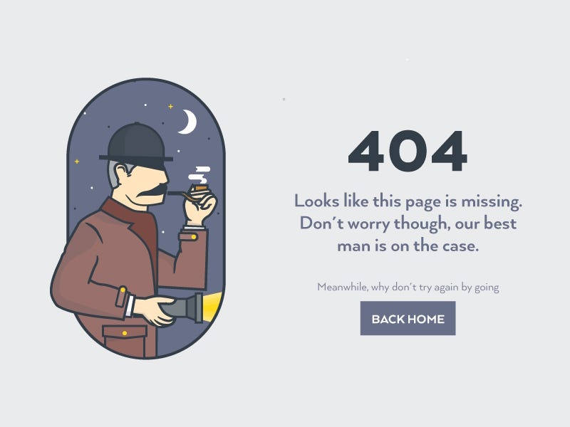

[](https://discord.gg/dRwW4rw)

# Serlokas

_website design project_

<br>

## 🌟 About

This project is for educational porpuses only, Pull rquest are welcome, but priority for project authors! Thank you for your cooperattion!

site published at :  https://aidas415.github.io/serlokas/

design: 

## 🎯 Project features/goals

-   Github pages
-   no responsive design
-   inline CSS

## 🎒 getting started

### 💻 Prerequisites

Node.js - _downLoad and install_

```
https://nodejs.org
```

Git - _dowLoad and install_

```
https://git-scm.com


### 🏃‍♀️‍➡️ Run locally

Woud like to run this project locally? Open terminal and follow these steps:

1. Clone the repo
    ```sh
    git clone https://aidas415.github.io/serlokas/
    ```
2. Install NPM packages
    ```sh
    npm i
    ```
    or
    ```sh
    npm install
    ```
2. Run the server
```sh
npm run dev
```

### 🧪 Running tests

There is no tests for this project.

## 👨‍💻 Authors

Aidas: [Github](https://github.com/Aidas415)

## ⚠️ License

Distributed under the MIT License. See LICENSE.txt for more information.

## 🔗 Other resourse

No othr resource.
